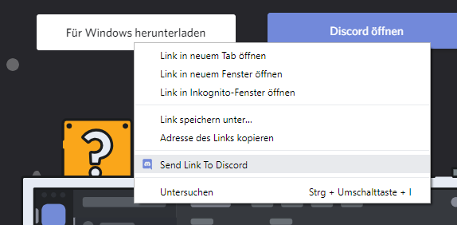
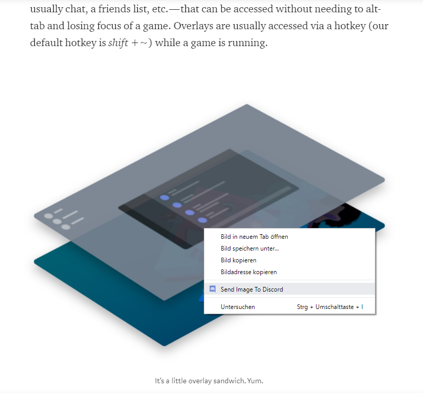
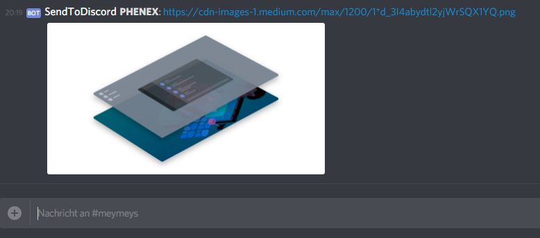
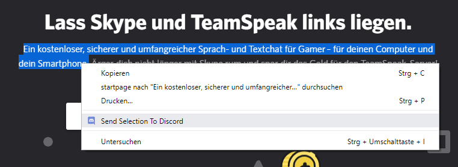
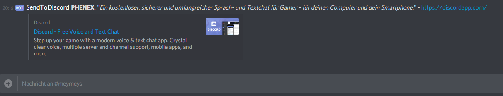

# Send To Discord

# Browser Extension to quickly send links to Pages, Images, Text-Selections, etc. to a Discord Channel via a WebHook

## Installation:
**Chrome Web Store:** https://chrome.google.com/webstore/detail/fdhmmlghpocfmbcjhjjhnjhbbnigaiin/

**Firefox Addon:** https://addons.mozilla.org/de/firefox/addon/sendtodiscord/

## Usage:
1. Create a Webhook for your Discord-Channel (via Server-Properties > Webhooks) and copy its URL.
1. Install the extension and log into your Discord Account
1. Paste the Webhook URL into the input field and click 'save'. If everything worked you should see details about your Webhook.
1. Right-Click an Element on a Page and select Send-To-Discord in the Context-Menu.
Supported Elements are: 
    * Whole pages
    * Links on pages
    * Images
    * Videos
    * Audio
    * Selected Text

## Examples:

**Link:**

**Image:**

**Text:**

